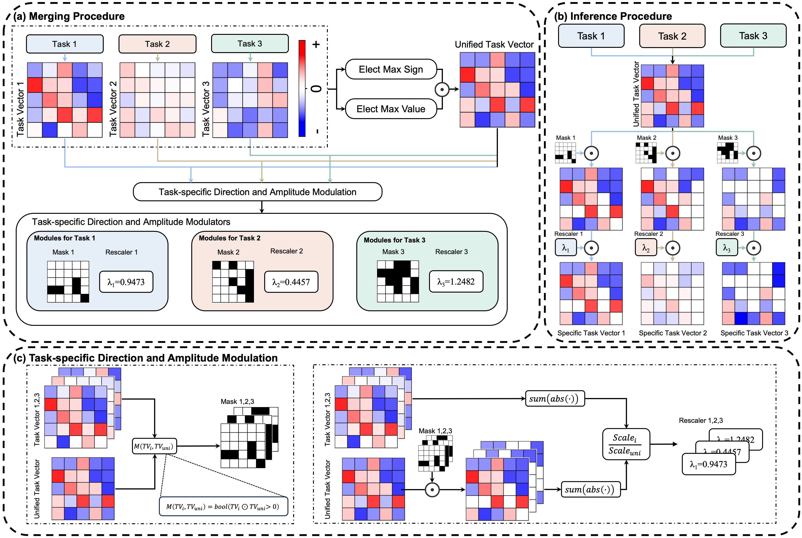

# EMR-Merging
This repository is the official implementation of EMR-Merging.

The success of pretrain-finetune paradigm brings about the release of numerous model weights. In this case, merging models finetuned on different tasks to enable a single model with multi-task capabilities is gaining increasing attention for its practicability. Existing model merging methods usually suffer from (1) significant performance degradation or (2) requiring tuning by additional data or training. We rethink and analyze the existing model merging paradigm. We discover that using a single model's weights can hardly simulate all the models' performance. To tackle this issue, we propose EMR-Merging. We first (a) elect a unified model from all the model weights and then (b) generate extremely lightweight task-specific modulators, including masks and rescalers, to align the direction and magnitude between the unified model and each specific model, respectively. EMR-Merging is tuning-free, thus requires no data availability or any additional training while showing impressive performance. We find that EMR-Merging shows outstanding performance compared to existing merging methods under different settings, including merging different numbers of vision models, NLP models, PEFT models, and multi-modal models.

> In the (a) Merging Procedure, we merge task-specific vectors into a unified task vector and light-weight task-specific modulators to modulate direction and amplitude. During the (b) Inference Procedure, we apply the corresponding mask and rescaler to the unified task vector to obtain a specific task vector. The process of (c)Task-specific Direction and Amplitude Modulation includes obtaining task-specific masks and scalers.

We realize data-less and high-performance model merging.

We provide the code for merging ViT models. In the future, we will release the code under different settings including NLP, PEFT, and multi-modal.

# Get Started

EMR-Merging requires no additional training. We merge models finetuned on different tasks and evaluate the merged model.

### Dependencies
Please follow [task_vectors](https://github.com/mlfoundations/task_vectors) to install the dependencies.

### Checkpoints and Datasets

You can download the fine-tuned checkpoints from the [task_vectors#checkpoints](https://github.com/mlfoundations/task_vectors#checkpoints).
The Google Drive folder is: [task_vectors_checkpoints](https://drive.google.com/drive/folders/1u_Tva6x0p6oxu5Eo0ZZsf-520Cc_3MKw)
Refer to dataset processing in the [task_vectors](https://github.com/mlfoundations/task_vectors) and [AdaMerging](https://github.com/EnnengYang/AdaMerging).

## Eval

Run Task Atithmetic [paper](https://arxiv.org/abs/2212.04089)
> python main_task_arithmetic.py

Run TIES-MERGING [paper](https://arxiv.org/abs/2306.01708)
> python main_ties_merging.py

Run Layer-wise AdaMerging++ [paper](https://arxiv.org/abs/2310.02575)
> python main_layer_wise_adamergingpp.py

Check [here](https://github.com/EnnengYang/AdaMerging) if you want to load the trained merge coefficients for AdaMerging.

Run EMR-Merging (Ours)
> python main_emr_merging.py

# Acknowledgement
Our implementation references the code below, thanks to them. 
- AdaMerging: https://github.com/EnnengYang/AdaMerging

- Task Arithmetic: https://github.com/mlfoundations/task_vectors

- TIES-MERGING: https://github.com/prateeky2806/ties-merging/tree/main

- Model Soups: https://github.com/mlfoundations/model-soups

